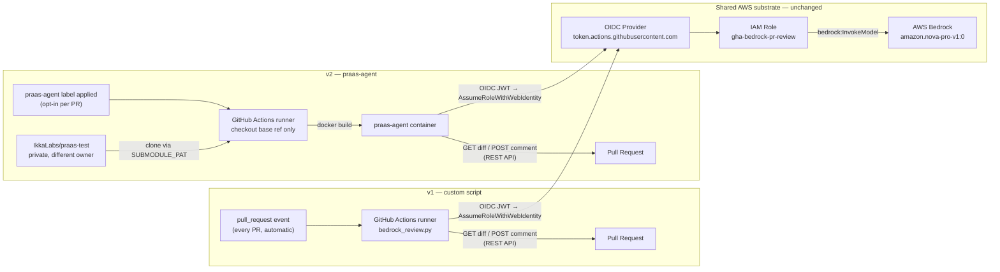

# PR Reviewer Architecture — v1 vs v2

Both versions authenticate to the *same* IAM role and call the *same* Bedrock model — nothing on the AWS side changed. What changed sits entirely on the GitHub side: v2 adds a cross-org clone (`SUBMODULE_PAT` against a private repo under a different owner) and a container build step before the OIDC hop, and trades the automatic every-PR trigger for a deliberate label.
